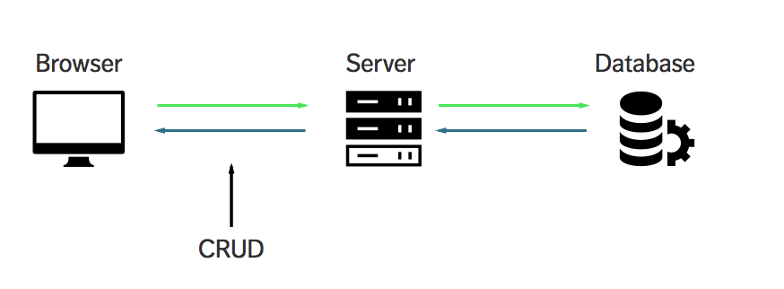

## Projeto de uma Aplicação(API) Back-End (CRUD) - seguindo as métricas de engenharia de software (MSC):

### o que é uma API?
> Uma API é um conjunto de rotinas, protocolos e ferramentas para construir aplicações.
> [Fonte: Stack OverFlow ](https://pt.stackoverflow.com/questions/86399/qual-a-diferen%C3%A7a-entre-endpoint-e-api);

### 1 - O que um CRUD?
> Nas manipulações de registros realizadas diretamente em banco de dados ou em plataformas
> desenvolvidas no padrão RESTful, o conceito CRUD estabelece o modelo correto no manuseio
> desses dados.
> CRUD representa as quatro principais operações realizadas em banco de dados, seja no modelo 
> relacional (SQL) ou não-relacional (NoSQL), facilitando no processamento dos dados e na 
> consistência e integridade das informações.  
> [Fonte de Informação: Blog byTrybe ](https://blog.betrybe.com/tecnologia/crud-operacoes-basicas/);

### 2 - Ferramentas e pacotes que utilizaremos no desenvolvimento da aplicação:

- [x] - FrameWork Express ;
- [x] - nodemom;
- [x] - body-parse;
  

### 3 - Comandos utilizados na instalação:

- [x] - npm i express;
- [Link Express ](https://www.npmjs.com/package/express)

- [x] - npm i body-parser
  > Middleware de análise do corpo do Node.js.
  > Analise os corpos de solicitação de entrada em um middleware antes de seus manipuladores,
  > disponíveis na propriedade req.body.
- [Body-Parse](https://www.npmjs.com/package/body-parser)

- [x] - npm i http-status-codes (OPCIONAL)
  > códigos de status http constantes enumerando os códigos de status HTTP.
  > Baseado na API Java Apache HttpStatus.
  - [status-codes](https://www.npmjs.com/package/http-status-codes)
  - 
### 4- Sobre os  END-POINTS:

#### 4.1 - O que é um End-Point?
> Um endpoint de um web service é a URL onde seu serviço pode ser acessado por uma aplicação cliente. 
> [Fonte: Stack OverFlow ](https://pt.stackoverflow.com/questions/86399/qual-a-diferen%C3%A7a-entre-endpoint-e-api);

##### 5- Conclusão e foco do projeto:

> Trabalhar com o módulo FS(File System) método nativo do node. Nesse projeto trabalhamoms com end-points que interagiram de forma assíncrona com o módulo explicitado logo acima, onde podemos desenvolver módulos como deleteFs.js contendo funções como (leituraConvertArqJson()) com end-point (deletaRegistro), módulo editFS.js contendo funções (leituraConvertArqJson()) com end-point tratandoObeto etc.
